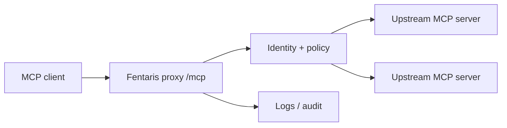

# Final Explanation

Finish setup tasks with a concise explanation that helps the user run what was built. Keep it short; do not turn the close-out into a full tutorial.

Include:

- The workflow chosen and why it fits the user's users, devices, runtime, and MCP servers.
- The files/configuration created or changed.
- The endpoint the client should use, such as `http://localhost:4000/mcp` when applicable.
- The upstream MCP servers connected through the proxy.
- The controls added: auth, users/groups, policy, secrets, logging, approvals, or runtime hooks.
- Any important current limits only when relevant to the user's setup.
- The validation commands run and their result.
- A clear note that deploy is not available yet only if deployment comes up.

Add a Mermaid flow diagram only when the setup is non-trivial or the user asks for architecture context:

Use ASCII instead if the target medium does not support Mermaid.
