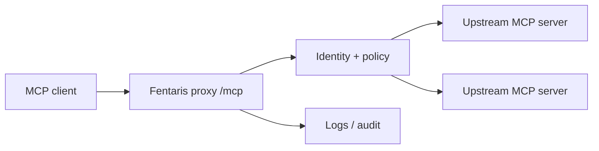

# Final Explanation

Finish setup tasks with a concise explanation that helps the user understand what was built and why Fentaris is useful.

Include:

- The workflow chosen and why it fits the user's users, devices, runtime, and MCP servers.
- The files/configuration created or changed.
- The endpoint the client should use, such as `http://localhost:4000/mcp` when applicable.
- The upstream MCP servers connected through the proxy.
- The controls added: auth, users/groups, policy, secrets, logging, approvals, or runtime hooks.
- Any important current limits, such as OAuth 2.1 or deploy not being available yet, when relevant to the user's setup.
- The validation commands run and their result.
- A clear note that deploy is not available yet if deployment comes up, plus that the CLI is expected to make deploy simpler later.

Add a Mermaid flow diagram when the setup is non-trivial:

Use ASCII instead if the target medium does not support Mermaid.
